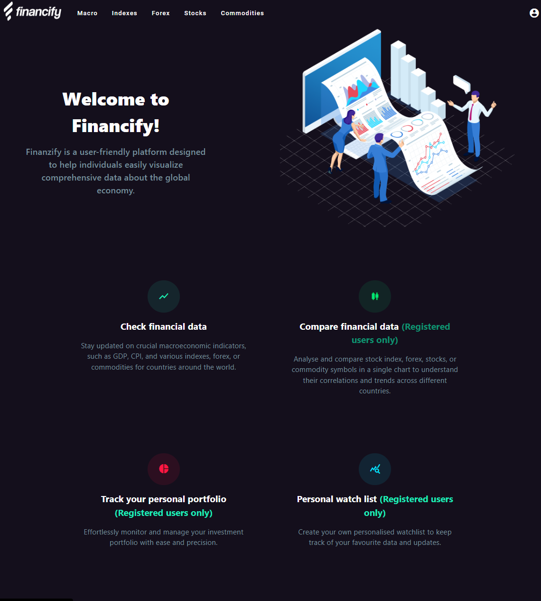
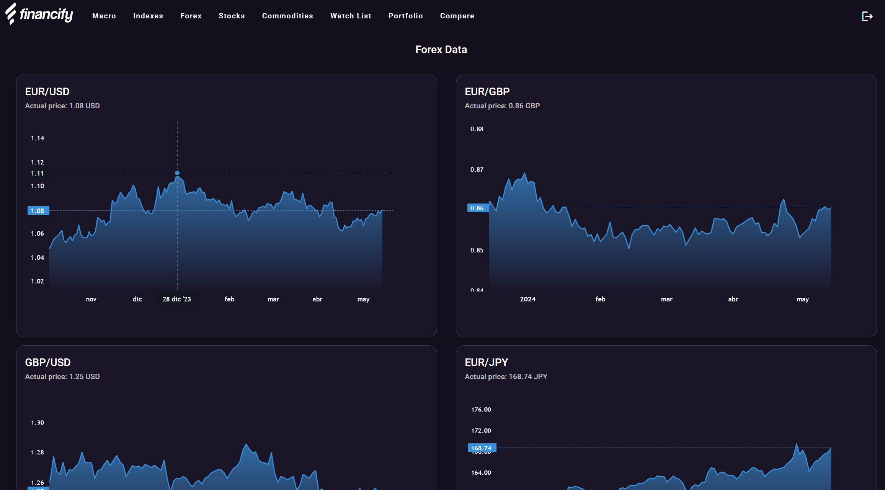
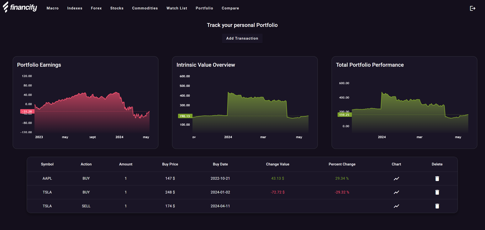
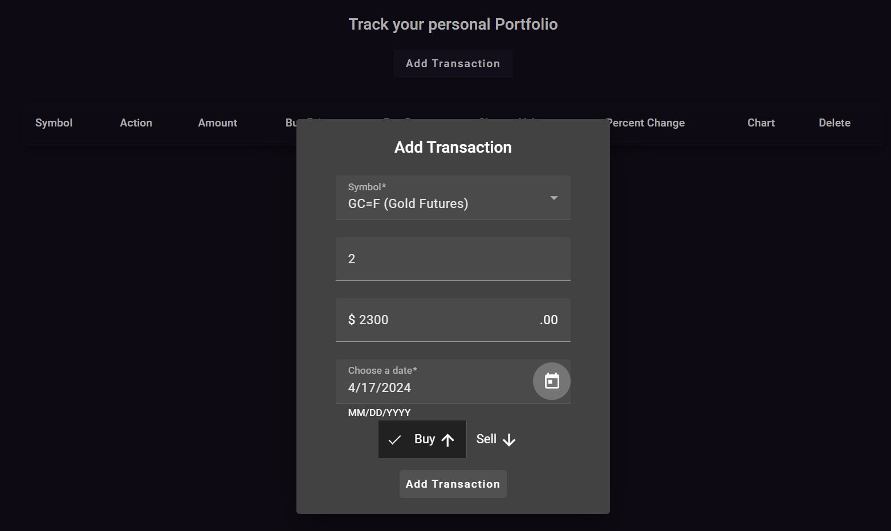
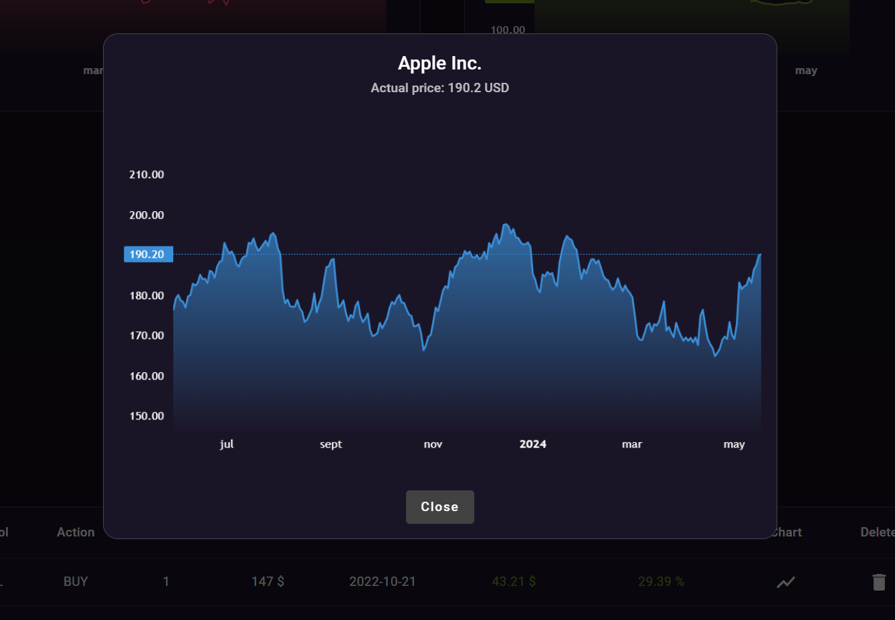
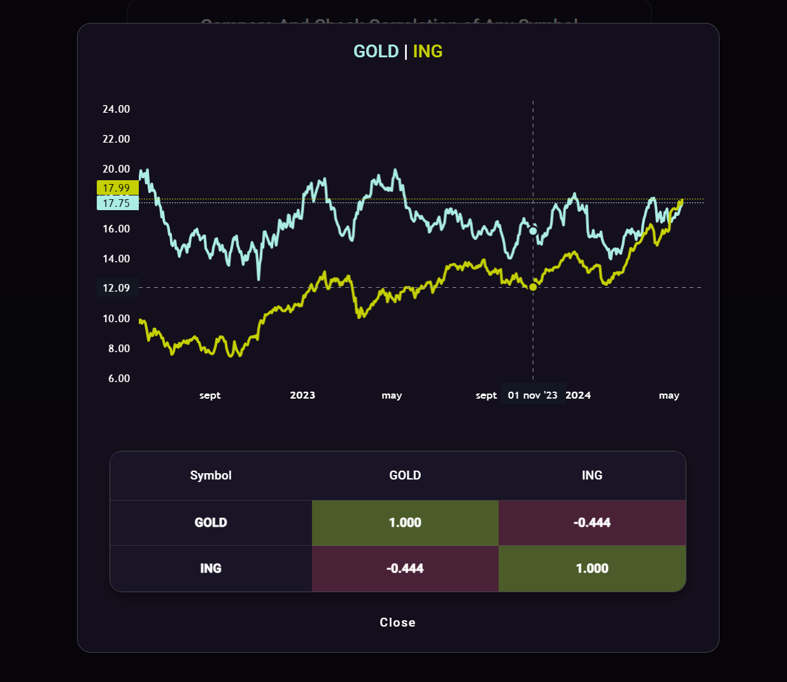
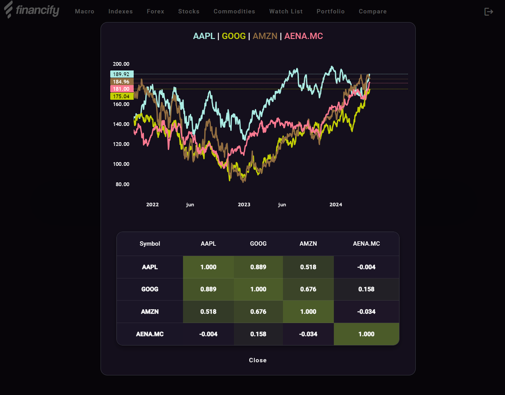

## Web application distributed in Services using Angular, Spring Boot, Python with FastAPI and deployed in Rancher using Kubernetes.

## The application has the following functionalities:

+ Visualisation of macroeconomic and financial data.
+ Portfolio tracking for investors (Only for registered users).
+ Stock comparison with a heat map with correlations between stocks (Only for registered users).
+ Custom Tracking List, to store the stocks that the user wants (Only for registered users).

## Web App Images:

### Main Page

### Check Financial Data

### Portfolio

### Portfolio Transaction

### Portfolio Chart

### Value Comparator

### Value Comparator with 4 values

